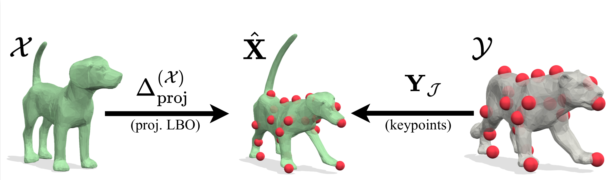

# SIGMA: Scale-Invariant Global Sparse Shape Matching

[Paper-CVF](https://openaccess.thecvf.com/content/ICCV2023/papers/Gao_SIGMA_Scale-Invariant_Global_Sparse_Shape_Matching_ICCV_2023_paper.pdf) | 
[Paper-arXiv](https://arxiv.org/abs/2308.08393) |



## Citation

If you find our work useful in your research, please consider citing:

```
@inproceedings{gao2023sigma,
    author 	= { Maolin Gao and Paul Roetzer and Marvin Eisenberger and Zorah L\"ahner and Michael Moeller and Daniel Cremers and Florian Bernard },
    title 	= { {SIGMA}: Scale-Invariant Global Sparse Shape Matching},
    booktitle = {International Conference on Computer Vision (ICCV)},
    year 	= 2023,
    keywords = {Shape Analysis, Geometry Processing, Global Optimisation, Mixed-Integer Programming, Laplace-Betrami}
}
```

> *Note:* The initial public release in this repository corresponds to
> the code version evluated in the ICCV'23 paper, after refactoring
> and cleanup. As the code evolves, runtime differences might become larger.

## Running SIGMA

Please install [YALMIP](https://yalmip.github.io/) and [MOSEK](https://www.mosek.com/) to be able to run the optimisation. 
At the time when this code is developed, the following package/software version are used:
1. YALMIP [Version R202110331](https://github.com/yalmip/YALMIP/tree/9e208fc67075716bcf74bb2c0289186b12754e08) 
2. MOSEK [Version 10.0.35](https://www.mosek.com/downloads/10.0.35/) (Build date: 2023-2-3 09:48:18)
3. gptoolbox is inlcuded under `code/external/gptoolbox-master/` for your convenience, however you might want to use a more up-to-date version.

Then please refer to `demo1.m` for an example of TOSCA cat and `demo2.m` for an example of SHREC20 Non-Isometric camel to dog.

> *Note:* The code was developed under MacOS and Ubuntu.


## Acknowledgement
We thank the authors of [BCICP](https://github.com/llorz/SGA18_orientation_BCICP_code) (Jing Ren, Adrien Poulenard, Peter Wonka and Maks Ovsjanikov.), from which we took inspiration of the orientation preservation term. Their code is provided as a copy in this repository for covenience. Some of their functions are adapted for our purposes, such as visualisation functions (`code/external/bcicp-repo/`).

We thank the authours of [gptoolbox](https://link.springer.com/book/10.1007/978-0-387-73301-2) (Alec Jacobson and co-authers) for providing the wonderfull geometry processing toolbox (`code/external/gptoolbox-master/`).


We also thank Dirk-Jan Kroon for open source their published function `patchnormals.m`.

## License

The code of the IsoMush project is licensed under a [BSD 3-Clause License](LICENSE).

Please also
consider licenses of used third-party codes and libraries. See folder `code/external`.
